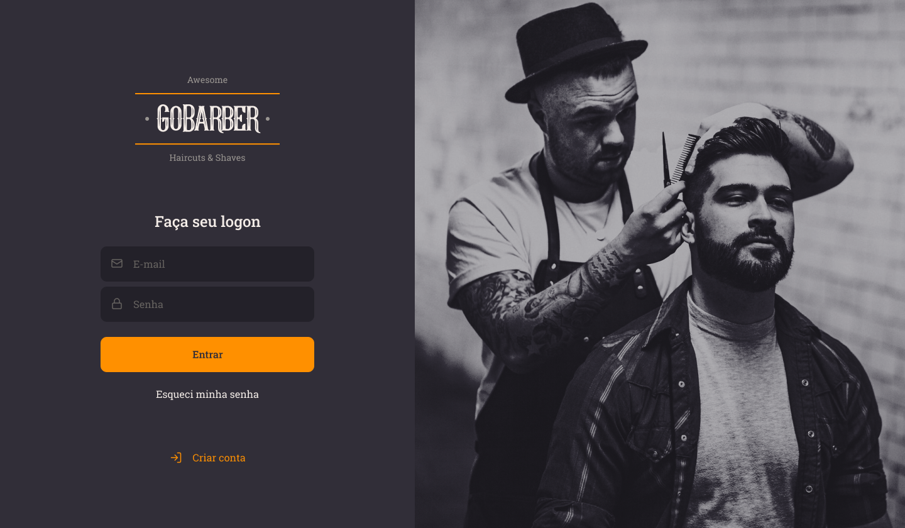
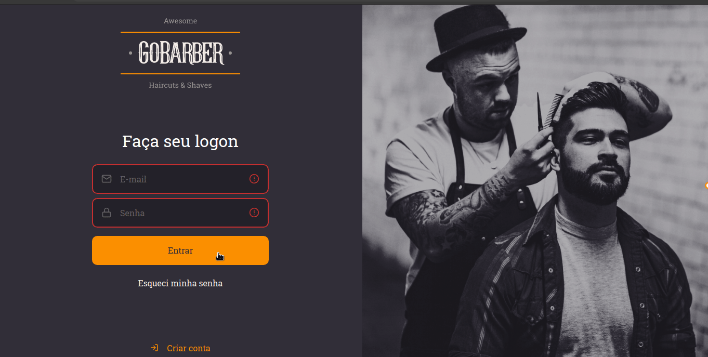

<h1 align="center">

</h1>



<p align="center"><strong>Um aplicativo de agendamento de barbeiro que mostra ao barbeiro sua agenda para o dia.</strong></p>


<h4 align="center">
	🚧  GoBarber  🚀 Em construção...  🚧
</h4

Tabela de conteúdos
=================
<!--ts-->
   * [Pré Requisitos](#-pré-requisitos)
   * [Tecnologias](#-tecnologias)
<!--te-->




### Pré-requisitos

Antes de começar, você vai precisar ter instalado em sua máquina as seguintes ferramentas:
[Git](https://git-scm.com), [Node.js](https://nodejs.org/en/).

Você pode utilizar o package manager de sua preferência, mas eu vou utilizar o [Yarn](https://yarnpkg.com/getting-started/install).

Além disto é bom ter um editor para trabalhar com o código como [VSCode](https://code.visualstudio.com/)

### 🎲 Rodando a aplicação web

```bash
# Clone este repositório
$ git clone <https://github.com/matheus-santos-moreira/gobarber-web>

# Acesse a pasta do projeto no terminal/cmd
$ cd gobarber-web

# Instale as dependências
$ yarn install

# Execute a aplicação em modo de desenvolvimento
$ yarn start

# Se tudo der certo a aplicação irá abrir no seu navegador
```

### 🛠 Tecnologias

As seguintes ferramentas foram usadas na construção do projeto:

- [React](https://pt-br.reactjs.org/)
- [Node.js](https://nodejs.org/en/)
- [TypeScript](https://www.typescriptlang.org/)

### Autor
---

<a href="https://www.linkedin.com/in/matheus-santos-moreira">
 
 <br />
 <sub><b>Matheus Santos</b></sub></a> <a href="https://www.linkedin.com/in/matheus-santos-moreira" title="Rocketseat">🚀</a>


Feito com ❤️ por Matheus Santos 👋🏽 Entre em contato!

 [](https://www.linkedin.com/in/matheus-santos-moreira)
[](mailto:contato@matheussantosdev.com)
